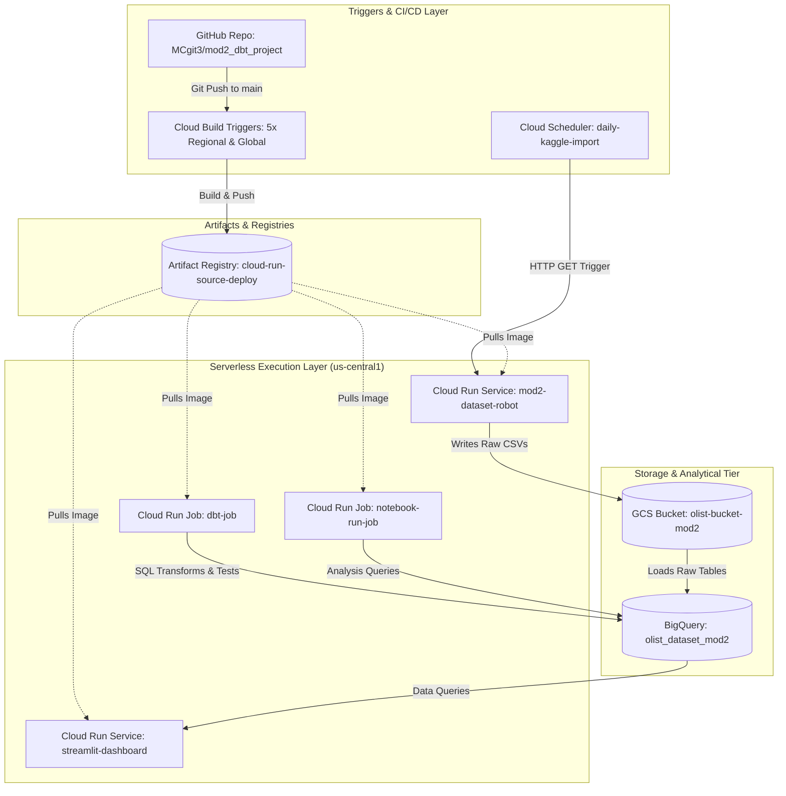

# GCP Project Configuration Report: My Project 58351

## Executive Summary

This document provides a consolidated view of the project's GCP architecture, configuration, identities, CI/CD triggers, serverless workloads, storage, analytics infrastructure, and component interconnections. The architecture uses Cloud Scheduler and GitHub/Cloud Build triggers to initiate data ingestion and application pipeline activities. Cloud Run Services and Cloud Run Jobs execute the ingestion, transformation, notebook analysis, and dashboard workloads. Google Cloud Storage acts as the raw data landing zone, BigQuery provides the analytical data layer, and Artifact Registry stores container images used by serverless workloads.

The sections below have been rearranged into an architecture-oriented order for easier reading. All original content has been retained; overlapping descriptions are intentionally preserved because they document the same components from different configuration views.

---

## 1. Architecture Overview

### 1.1 Network Topology & Architecture Specification

---

### 1.2 Component Interconnections

| Source Component | Target Component | Protocol / Mechanism | IAM Identity Used | Purpose |
|---|---|---|---|---|
| Cloud Scheduler | mod2-dataset-robot | HTTPS Invocation | Google Service Agent | Initiates daily Kaggle dataset extraction |
| mod2-dataset-robot | olist-bucket-mod2 (GCS) | Cloud Storage API | bigquery-admin-717 | Uploads extracted raw CSV files |
| mod2-dataset-robot | olist_dataset_mod2 (BQ) | BigQuery Storage API | bigquery-admin-717 | Loads structured raw tables |
| GitHub | Cloud Build | Webhook Event | Managed Connection | Triggers on commit changes by path |
| Cloud Build | Artifact Registry | Docker Push (v2) | dbt-runner | Stores compiled versioned images |
| Artifact Registry | Cloud Run Services & Jobs | Docker Pull (v2) | Compute / dbt-runner | Deploys container revisions |
| dbt-job | olist_dataset_mod2 (BQ) | BigQuery Client API | dbt-runner | Runs SQL models and schema tests |
| notebook-run-job | olist_dataset_mod2 (BQ) | BigQuery Client API | dbt-runner | Executes Papermill notebook reports |
| streamlit-dashboard | olist_dataset_mod2 (BQ) | BigQuery Read API | Default Compute SA | Visualizes dashboard metrics |

---

## 2. Identity & IAM Configuration

## Service Accounts & Settings

The following user-managed and system-managed service accounts are active in the project. Each has been assigned specific IAM roles at the project level to execute database queries, manage storage buckets, and run build triggers.

| Display Name | Email Address | Assigned Project IAM Roles | Purpose / Operations |
| :--- | :--- | :--- | :--- |
| **bigquery-admin** | `bigquery-admin-717@hale-badge-505304-j8.iam.gserviceaccount.com` | • `BigQuery Admin` • `Cloud Build Editor` • `Storage Object Admin` | Serves as the identity for your Kaggle ingestion service (`mod2-dataset-robot`). This grants it full read/write rights over GCS buckets and BigQuery tables. |
| **dbt-runner** | `dbt-runner@hale-badge-505304-j8.iam.gserviceaccount.com` | • `Artifact Registry Reader` • `Artifact Registry Writer` • `BigQuery Admin` • `BigQuery Data Editor` • `BigQuery User` • `Cloud Run Developer` • `Cloud Run Invoker` • `Logs Writer` • `Service Account User` • `Storage Object Viewer` | The core execution identity for your pipelines. This extensive permission set enables `dbt-runner` to run `dbt-job` and `notebook-run-job`, pull/push builds in Artifact Registry, and write schemas to BigQuery. |
| **Default compute service account** | `<PROJECT_NUMBER>-compute@developer.gserviceaccount.com` | • `Editor` | Assigned by default to standard Compute and serverless workloads (such as your `streamlit-dashboard` service). |
| **App Engine default service account** | `hale-badge-505304-j8@appspot.gserviceaccount.com` | • `Editor` | The legacy default service account associated with the project's App Engine resource allocations. |

---

### Detailed Operations of Service Account Roles

#### A. `dbt-runner` Service Account Permissions

With 10 distinct roles assigned, the `dbt-runner` account is designed to fully coordinate CI/CD pipelines and analytical runs:

1. **BigQuery Admin & Data Editor:** Allows full control over schemas, compiling transformations, and running test operations on the `olist_dataset_mod2` dataset.
2. **Cloud Run Developer & Invoker:** Permits creating, managing, and triggering tasks on the serverless compute layers (`dbt-job`, `notebook-run-job`).
3. **Artifact Registry Writer/Reader:** Allows your Cloud Build triggers to compile container images and publish/pull them to your Docker repositories.
4. **Service Account User:** Allows your triggers to run container tasks using this specific credentials boundary.
5. **Storage Object Viewer:** Permits reading raw datasets or metadata stored in the Cloud Storage file layers.

#### B. `bigquery-admin-717` Service Account Permissions

Designed strictly for automated background data ingestion:

1. **Storage Object Admin:** Grants full capability to upload, read, and delete raw Kaggle CSV files inside `olist-bucket-mod2`.
2. **BigQuery Admin:** Enables importing those CSV files as structured tables directly into BigQuery.
3. **Cloud Build Editor:** Permits triggering builds associated with automated data landing tasks.

### Key Observations & Settings

* The **`dbt-runner`** service account is designated for executing your automated pipelines and triggers.
* The **`bigquery-admin`** service account is configured to handle BigQuery operations and is currently attached to your automated data import service.
* For further reference, check out the official [Service Account Overview](https://docs.cloud.google.com/iam/docs/service-account-overview).

---

## 3. Triggering & CI/CD Architecture

## Cloud Build Triggers & Settings

An active automated CI/CD pipeline integrated directly with GitHub:

The following lists all triggers configured in the project, which monitor changes in the shared GitHub repository **`MCgit3/mod2_dbt_project`** and selectively run builds based on the changed paths using the `_PIPELINE_MODE` variable.

### A. `dbt-code-trigger` (Global)

* **Region:** `global`
* **Event:** Automatic push to branch matching `^main$`
* **Build File:** `cloudbuild.yaml`
* **Executing Service Account:** `dbt-runner@hale-badge-505304-j8.iam.gserviceaccount.com`
* **Involved File Filters:** Only runs if modifications are made in:
  * `models/**`, `macros/**`, `seeds/**`, `snapshots/**`, `tests/**`, `dbt_project.yml`, `packages.yml`, `profiles.yml`
* **Substitutions:**
  * `_PIPELINE_MODE`: `dbt`
  * `_TRIGGER_TYPE`: `code`

### B. `data-pipeline-trigger` (Regional)

* **Region:** `us-central1`
* **Description:** *"Run when mod2-dataset-robot detects new Kaggle data"*
* **Event:** **Manual** execution (configured to build off of `refs/heads/main`)
* **Build File:** `cloudbuild.yaml`
* **Executing Service Account:** `dbt-runner@hale-badge-505304-j8.iam.gserviceaccount.com`
* **Substitutions:**
  * `_PIPELINE_MODE`: `data`

### C. `shared-image-trigger` (Regional)

* **Region:** `us-central1`
* **Event:** Automatic push to branch matching `^main$`
* **Build File:** `cloudbuild.yaml`
* **Executing Service Account:** `dbt-runner@hale-badge-505304-j8.iam.gserviceaccount.com`
* **Involved File Filters:** Only runs if modifications are made in:
  * `Dockerfile`
* **Substitutions:**
  * `_PIPELINE_MODE`: `shared-image`

### D. `streamlit-trigger` (Regional)

* **Region:** `us-central1`
* **Event:** Automatic push to branch matching `^main$`
* **Build File:** `cloudbuild.yaml`
* **Executing Service Account:** `dbt-runner@hale-badge-505304-j8.iam.gserviceaccount.com`
* **Involved File Filters:** Only runs if modifications are made in:
  * `app.py`
* **Substitutions:**
  * `_PIPELINE_MODE`: `streamlit`

### E. `notebook-trigger` (Regional)

* **Region:** `us-central1`
* **Event:** Automatic push to branch matching `^main$`
* **Build File:** `cloudbuild.yaml`
* **Executing Service Account:** `dbt-runner@hale-badge-505304-j8.iam.gserviceaccount.com`
* **Involved File Filters:** Only runs if modifications are made in:
  * `notebooks/**`
* **Substitutions:**
  * `_PIPELINE_MODE`: `notebook`

---

## 4. Serverless Compute Architecture

# Active Serverless Workloads (Services & Jobs) - My Project 58351

This section outlines the purpose, configuration, environment variables, resource sizing, and security configurations of all active and utilized Cloud Run Services (request-driven) and Cloud Run Jobs (batch-driven) in the `us-central1` (Iowa) region.

---

## 4.1 Request-Driven Web Services (Cloud Run Services)

Services are optimized for persistent, request-driven workloads that automatically scale up/down to handle incoming HTTP web traffic.

### A. `mod2-dataset-robot` (Data Ingestion Robot)

* **Purpose:** Automatically fetches data from Kaggle, processes it, and uploads the results to Google Cloud Storage (GCS) and BigQuery. It is triggered on a daily basis via Cloud Scheduler.
* **Region:** `us-central1`
* **Service URL:** `https://mod2-dataset-robot-<PROJECT_NUMBER>.us-central1.run.app`
* **Container Image:** `us-central1-docker.pkg.dev/hale-badge-505304-j8/cloud-run-source-deploy/mod2-dataset-robot:latest`
* **Language Runtime/Base Image:** `python314` (Google serverless-runtimes base)
* **Execution Identity (Service Account):** `bigquery-admin-717@hale-badge-505304-j8.iam.gserviceaccount.com`
* **Resource Specifications:**
  * **CPU:** `1000m` (1 vCPU, only allocated during request processing)
  * **Memory:** `512Mi`
  * **Concurrency:** `80` requests per instance
  * **Scaling Limits:** Min: `0`, Max: `20`
* **Configured Environment Variables:**
  * `BUCKET_NAME`: `olist-bucket-mod2` (Target Cloud Storage bucket)
  * `DATASET_ID`: `olist_dataset_mod2` (Target BigQuery dataset)
  * `KAGGLE_USERNAME`: `MyTechDS`
  * `KAGGLE_KEY`: `KGAT_...` *(masked for security)*
* **Source Code Repository:**  
  * GitHub: `https://github.com/MCgit3/mod2_dbt_project`  
  * Path: `src/mod2_dataset_robot/`  
  * Maintained for collaboration and version control.  
  * Teammates can review, update, and propose changes via pull requests.  

### Notes
- The service is **deployed and executed in GCP**; teammates do not need to trigger it manually from GitHub.  
- GitHub serves as the **source of truth** for code review, collaboration.

### B. `streamlit-dashboard` (Business Intelligence Dashboard)

* **Purpose:** Hosts an interactive web dashboard built with Streamlit for business analytics and data visualizations.
* **Region:** `us-central1`
* **Service URL:** `https://streamlit-dashboard-<PROJECT_NUMBER>.us-central1.run.app`
* **Container Image:** `gcr.io/hale-badge-505304-j8/dbt-runner:954c298f-7864-496f-bc80-fd18578925e4`
* **Execution Identity (Service Account):** `<PROJECT_NUMBER>-compute@developer.gserviceaccount.com` (Default Compute Engine service account)
* **Resource Specifications:**
  * **CPU:** `1000m` (1 vCPU, only allocated during request processing)
  * **Memory:** `512Mi`
  * **Concurrency:** `80` requests per instance
  * **Scaling Limits:** Min: `0`, Max: `20`

---

## 4.2 Batch Data Processing (Cloud Run Jobs)

Jobs are optimized for run-to-completion processes. They run on-demand or on a schedule, executing background work and exiting once complete.

### A. `dbt-job` (DBT Orchestration & Testing)

* **Purpose:** Executes automated SQL data transformations and schema validation checks using the DBT (Data Build Tool) framework.
* **Container Image:** `gcr.io/hale-badge-505304-j8/dbt-runner:bdcb95fc-d5e3-4a65-80fd-4a3027a94944`
* **Execution Identity (Service Account):** `dbt-runner@hale-badge-505304-j8.iam.gserviceaccount.com`
* **Runtime Configuration:**
  * **Command:** `sh`
  * **Arguments:** `-c dbt run && dbt test`
  * **Task Sizing:** Memory: `512Mi`, CPU: `1000m` (1 vCPU)
  * **Task Timeout:** `10 minutes`
  * **Max Retries:** `3` (retries upon error)
  * **Parallel Tasks:** `1`

### B. `notebook-run-job` (Jupyter Notebook Analysis Execution)

* **Purpose:** Runs automated data analysis and reporting directly on Jupyter Notebooks via the Papermill execution engine.
* **Container Image:** `gcr.io/hale-badge-505304-j8/dbt-runner:bdcb95fc-d5e3-4a65-80fd-4a3027a94944`
* **Execution Identity (Service Account):** `dbt-runner@hale-badge-505304-j8.iam.gserviceaccount.com`
* **Runtime Configuration:**
  * **Command:** `papermill`
  * **Arguments:** `/app/notebooks/analysis.ipynb /app/notebooks/analysis_output.ipynb`
  * **Task Sizing:** Memory: `512Mi`, CPU: `1000m` (1 vCPU)
  * **Task Timeout:** `10 minutes`
  * **Max Retries:** `3`
  * **Parallel Tasks:** `1`

---

## 5. Supporting Storage, Registries & Database Infrastructure

To support the serverless execution and automated pipelines, the project utilizes the following managed storage and analytical database resources in Google Cloud:

### A. Artifact Registry (Container Registry Storage)

The container images compiled during your Cloud Build trigger runs are securely stored and managed in the Artifact Registry before deployment to Cloud Run.

* **Repository Name:** `cloud-run-source-deploy`
* **Format:** `DOCKER`
* **Repository Mode:** `STANDARD_REPOSITORY`
* **Region/Location:** `us-central1` (Iowa)
* **Encryption Setting:** Google-managed encryption key
* **Associated Settings & Purpose:**
  * *Clean-up Policies:* Standard configuration allows pushing tags (`:latest` and unique commit shas) dynamically.
  * *Service Integration:* Directly integrated with Cloud Build (which pushes built images) and Cloud Run (which pulls images for active containers).

### B. Google Cloud Storage (File Landing Zone)

Acts as the raw file ingestion and landing zone for dataset uploads before they are loaded and modeled in BigQuery.

* **Bucket Name:** `olist-bucket-mod2`
* **Default Storage Class:** `Standard` (optimized for high-frequency access by active Cloud Run services)
* **Location:** `us-central1` (Co-located with Cloud Run compute instances to avoid data egress charges and minimize processing latency)
* **Associated Settings & Purpose:**
  * *Access Control:* Accessible securely via IAM credentials granted to the `bigquery-admin-717` service account.
  * *Public Access Prevention:* Enabled (ensures that raw data files are not publicly readable over the internet).

### C. BigQuery (Data Warehouse & Analytical Layer)

The destination database where raw data is structured, modeled, and transformed using dbt pipeline runs.

* **Dataset ID:** `olist_dataset_mod2`
* **Location:** `us-central1` (or regional US group)
* **Associated Settings & Purpose:**
  * *IAM Permissions:* The service account `bigquery-admin-717@hale-badge-505304-j8.iam.gserviceaccount.com` has Admin access to run queries, write tables, and execute dataset modifications.
  * *Integration with dbt:* `dbt-job` directly targets this dataset to compile raw tables, run schema tests, and build clean analytical views.

