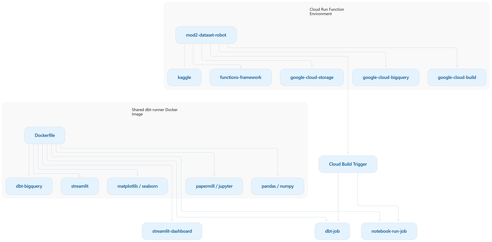

# Cloud-Native Automated Data Pipeline Architecture (Serverless + CI/CD)

## 📊 Executive Summary

This design outlines a cloud‑native, automated data pipeline that integrates ingestion, transformation, and visualization in a serverless environment. The system leverages Google Cloud services — including Cloud Run, Cloud Functions, Cloud Build, BigQuery, and Cloud Storage — alongside data tools such as dbt, Papermill, Jupyter, and Streamlit.

At a high level:
- **Data ingestion**: Kaggle datasets are automatically pulled into Google Cloud Storage and BigQuery on a nightly schedule.  
- **Transformation**: dbt models and parameterized Jupyter notebooks (via Papermill) process and enrich the data.  
- **Automation**: Cloud Build triggers orchestrate workflows whenever code changes or new data arrives, ensuring CI/CD practices are applied consistently.  
- **Visualization**: Results are published to interactive dashboards built with Streamlit and deployed on Cloud Run.  

This architecture minimizes manual intervention, scales automatically with demand, and ensures reproducibility of analytics workflows. It provides both engineers and analysts with a reliable foundation for continuous data updates and real‑time insights.

## 📘 Overview
This document describes the architecture, triggers, and workflows for our automated data pipeline using **Cloud Run, Cloud Functions, Cloud Build, dbt, Papermill, BigQuery, and Streamlit**.  
It explains how data ingestion, transformation, and visualization are orchestrated in a serverless environment, with CI/CD automation and reproducible notebook execution.

---

## 🌐 What “Serverless” Means
Serverless doesn’t mean there are literally no servers. It means you don’t manage the servers yourself.  
In **Cloud Run** or **Cloud Functions**, Google runs your code inside containers or lightweight runtimes on their infrastructure.  
You don’t provision VMs, patch operating systems, or worry about scaling — the platform automatically spins up and down compute resources depending on requests.  

**ELI5:** You write code, Google runs it. You don’t see the computer, but it’s there. It grows or shrinks automatically depending on how many people use it.

---

## 1. Overall Architecture — The Big Picture
The diagrams below illustrate the high-level design of the pipeline and CI/CD flows.

**End-to-End Automated Data Pipeline and CI/CD Architecture**
-1.png>)

**Git Push–Triggered Cloud Build and Cloud Run Pipeline Flow**
-1.png>)

**Cloud-Native Data Workflow: Functions, Containers, and Build Triggers**

---

## 2. Kaggle Data Ingestion Flow
This nightly process ingests Kaggle datasets into Google Cloud Storage and BigQuery, ensuring fresh data for downstream analytics.
.png>)

---

## 3. Data Update Pipeline Flow
Triggered when new data arrives, this pipeline updates BigQuery tables and downstream dashboards.
.png>)

---

## 4. dbt Code Trigger
When dbt models are updated (`models/**`), Cloud Build runs dbt transformations and redeploys dependent services.
.png>)

---

## 5. Notebook Trigger
Changes in Jupyter notebooks (`notebooks/**`) trigger Papermill execution, producing parameterized outputs for analytics.
.png>)

---

## 6. Streamlit Trigger
Updates to the Streamlit app (`app.py`) trigger redeployment of the dashboard service in Cloud Run.
.png>)

---

## 7. Shared Image Trigger
Changes to the Dockerfile rebuild the shared dbt-runner image, ensuring consistent environments across services.
.png>)

---

## 8. All Git Triggers Together
This diagram shows how multiple triggers interact to orchestrate the pipeline.
.png>)

---

## 9. Decision Table — Quick Reference

| What changed?    | Trigger                |   dbt | Notebook | Streamlit | Image update |
| ---------------- | ---------------------- | ----: | -------: | --------: | ------------: |
| Kaggle data      | Data pipeline          | ▶ Run |    ▶ Run |    Update | No code rebuild ideally* |
| `models/**` etc. | `dbt-code-trigger`     | ▶ Run |    ▶ Run |    Deploy | Depends on your YAML |
| `notebooks/**`   | `notebook-trigger`     |     ❌ |    ▶ Run |    Deploy | Depends on your YAML |
| `app.py`         | `streamlit-trigger`    |     ❌ |        ❌ |    Deploy | Depends on your YAML |
| `Dockerfile`     | `shared-image-trigger` | ▶ Run |    ▶ Run |    Deploy | Update all |

**Legend:**  
- ▶ Run = pipeline executes  
- ❌ = no action  
- ⏭️ = skipped  
- Update = refresh dashboard with latest data  
- Deploy = redeploy service with new build  

---

## ✅ Conclusion

The architecture introduced in Section 1 remains the recommended design for our automated data pipeline.  
By combining nightly ingestion, event-driven triggers, and CI/CD workflows, the system ensures reproducible analytics, scalable deployments, and up-to-date dashboards.  
This approach minimizes manual intervention, leverages serverless scaling, and provides a reliable foundation for continuous data updates and real-time insights.

---

## 📖 Glossary

### Cloud Services
- **Cloud Run**  
  A fully managed service that runs containerized applications.  
  **ELI5:** Like a vending machine for apps — you drop in your container, it serves users automatically.

- **Cloud Functions**  
  A serverless compute service for running single-purpose functions in response to events.  
  **ELI5:** Like a light switch — it only turns on when triggered.

- **Cloud Build**  
  A CI/CD service that executes build pipelines.  
  **ELI5:** A robot that builds and deploys your code whenever you push changes.

- **Cloud Build Trigger**  
  A configuration that automatically starts a Cloud Build pipeline when a specific event occurs.

- **BigQuery**  
  Google’s cloud data warehouse designed for fast SQL queries on large datasets.  
  **ELI5:** A giant spreadsheet that answers questions super fast.

- **Google Cloud Storage (GCS)**  
  Object storage for files, datasets, and artifacts.

---

### Tools & Frameworks
- **Docker**  
  A platform for packaging applications and dependencies into portable containers.  
  **ELI5:** Like a lunchbox — everything your app needs is inside.

- **Dockerfile**  
  A text file with instructions to build a Docker image.

- **Knative YAML**  
  The Kubernetes-based specification used by Cloud Run to define deployments.

- **Papermill**  
  A Python library for parameterizing and executing Jupyter notebooks.  
  **ELI5:** A robot that presses play on your notebook with different inputs.

- **Jupyter Notebook**  
  An interactive environment for writing and running Python code, visualizations, and documentation.

- **Streamlit**  
  A Python framework for building interactive web dashboards directly from scripts.

- **dbt (Data Build Tool)**  
  A framework for transforming data in warehouses using SQL.

---

### Concepts
- **CI/CD (Continuous Integration / Continuous Deployment)**  
  Practices for automatically building, testing, and deploying code changes.

- **Autoscaling**  
  A cloud feature that automatically adjusts the number of running instances based on demand.

- **IAM (Identity and Access Management)**  
  Google Cloud’s system for managing permissions and roles.

---

## ✅ Assumptions & Limitations
- Nightly Kaggle ingestion assumed.  
- Max scaling set to 20 instances for Cloud Run services.  
- Notebook execution relies on Papermill; reproducibility requires consistent environments.

---

## 🚀 Future Enhancements
- Add monitoring with Cloud Logging.  
- Integrate CI/CD tests for dbt models.  
- Automate dashboard refresh scheduling.  
